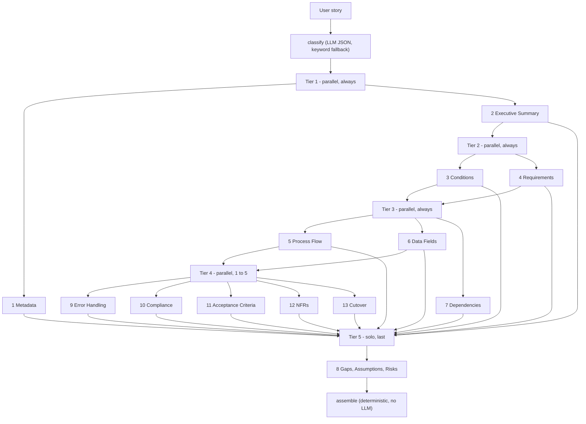
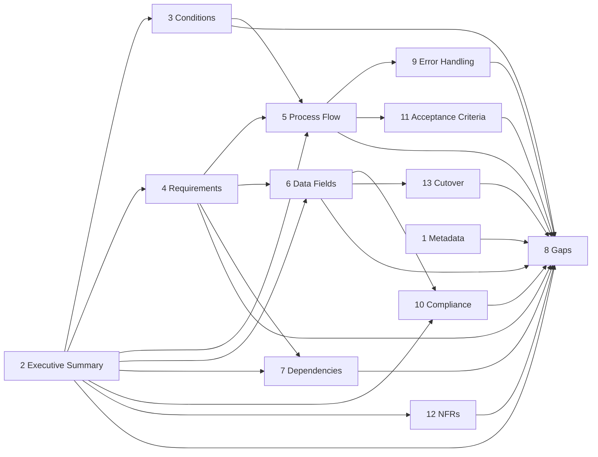

# FDD Multi-Agent Architecture

A 13-agent LangGraph pipeline that turns one user story into a Functional
Design Document.

LangGraph nodes are **execution tiers** (parallel batches), not one node
per agent. The arrows below are the **data dependencies** each agent
actually copies into its `payload` in `run()`. No agent is handed the
full `sections` dict except Agent 8. Agent 8 is the one agent that reads
every finished FDD section.

Input: `raw_user_story` (and optional `ticket_metadata`).

Output per run: `output/run_<timestamp>/generated_fdd.md`,
`generated_fdd.pdf`, and `fdd_state.json`. The same handoff is also
written to `output/fdd_state.json` for `tdd_pipeline`. That file is
`{ "tier", "sections" }` only. It does not include `raw_user_story`.

Graph: `classify → tier1 → tier2 → tier3 → tier4 → tier5 → assemble`

Agents in the same tier share the same pre-tier state and never see each
other’s output.

---

## 1. Sections, agent files, and tiers

| # | Section | Agent file | Tier | When it runs |
|---|---|---|---|---|
| 1 | Document Metadata & Traceability | `agents/agent1_metadata.py` | 1 | always |
| 2 | Executive Summary & Intent | `agents/agent2_executive_summary.py` | 1 | always |
| 3 | Pre-/Post-Conditions | `agents/agent3_conditions.py` | 2 | always |
| 4 | Functional Requirements | `agents/agent4_functional_requirements.py` | 2 | always |
| 5 | Process Flow & Logic States | `agents/agent5_process_flow.py` | 3 | always |
| 6 | Data & Field Specifications | `agents/agent6_data_fields.py` | 3 | always |
| 7 | Dependencies | `agents/agent7_dependencies.py` | 3 | always |
| 9 | Error Handling Matrix | `agents/agent9_error_handling.py` | 4 | `tier` is medium or large, or `needs_error_handling` |
| 10 | Localization & Compliance | `agents/agent10_localization_compliance.py` | 4 | `needs_compliance` |
| 11 | Acceptance Criteria | `agents/agent11_acceptance_criteria.py` | 4 | always |
| 12 | Non-Functional Requirements | `agents/agent12_nfr.py` | 4 | `needs_nfr` |
| 13 | Transition & Cutover | `agents/agent13_transition_cutover.py` | 4 | `tier` is large and `needs_cutover` |
| 8 | Gaps, Assumptions & Risks | `agents/agent8_gaps_assumptions_risks.py` | 5 | always, last |

Section numbers follow the document, not the tier order. Agents 9, 10,
11, 12, and 13 run together in Tier 4. Agent 8 is alone in Tier 5, after
Tier 4, even though it is printed as section 8.

`assemble` is not an LLM call. `classify` is: one small JSON call
(`CLASSIFIER_PROMPT` in `orchestrator.py`). If that call fails, a keyword
scan in `_fallback_classify` runs instead.

Always included: `1, 2, 3, 4, 5, 6, 7, 8, 11`.

| Flag / rule | Agent |
|---|---|
| `tier` is medium or large, or `needs_error_handling` | **9** |
| `needs_compliance` | **10** |
| `needs_nfr` | **12** |
| `tier` is large and `needs_cutover` | **13** |

| Tier | Meaning |
|---|---|
| **small** | One field or one screen. No new entity, no status lifecycle, no money or regulated data, no stated latency. |
| **medium** | A new flow, 1–2 existing systems, statuses, or approval/notification. No third party and no regulated data. Agent 9 is forced on. Agent 13 stays off. |
| **large** | New subsystem, money/pricing, PII or other regulated data, audit/compliance, a third party, or a revenue-, safety-, or compliance-critical domain. Agent 9 is forced on. Agents 10, 12, and 13 follow their flags. |

A section the classifier skips is written as `{ "triggered": false }` by
`graph.py`. An optional agent that runs and decides the section does not
apply returns the same shape itself.

A small story with every flag false runs 10 LLM calls: the classifier
plus Agents 1–8 and 11.

---

## 2. Execution tiers

| Tier | Agents | Runs | Depends on |
|---|---|---|---|
| classify | — | first | `raw_user_story` only |
| 1 | 1, 2 | parallel, always | story; agents do not see each other |
| 2 | 3, 4 | parallel, always | story + Agent 2 |
| 3 | 5, 6, 7 | parallel, always | Agents 2 and 4; Agent 5 also reads Agent 3 |
| 4 | 11 always; up to 4 of 9, 10, 12, 13 | parallel | Agent 2, 5, or 6, per agent; 13 also reads `tier` |
| 5 | 8 | solo, always last | every `sections` entry + `assumptions_pool` |
| assemble | — | last | finished sections, no LLM |

---

## 3. Internal dependency graph

Which of the 13 agents need another of the 13’s output. An empty cell
means that agent reads only the story (plus `ticket_metadata` for Agent 1,
or `tier` for Agent 13).

| Agent | Needs output from |
|---|---|
| 1 Metadata | none |
| 2 Executive Summary | none |
| 3 Conditions | **2** (`persona_definition`, `parsed_clauses`, `out_of_scope`) |
| 4 Requirements | **2** (`parsed_clauses`, `in_scope`, `out_of_scope`) |
| 5 Process Flow | **2** (`out_of_scope`), **3** (`pre_conditions`, `post_conditions`), **4** (`requirements`) |
| 6 Data Fields | **2** (`out_of_scope`), **4** (`requirements`) |
| 7 Dependencies | **2** (`in_scope`, `out_of_scope`), **4** (`requirements`) |
| 9 Error Handling | **5** (`exception_paths`) |
| 10 Compliance | **2** (`persona_definition`), **6** (`fields`) |
| 11 Acceptance Criteria | **5** (`happy_path`, `exception_paths`) |
| 12 NFRs | **2** (`business_objective`, `parsed_clauses.so_that`) |
| 13 Cutover | **6** (`fields`) |
| 8 Gaps | **1–7 and 9–13** (every finished section) + `assumptions_pool` |

Same-tier agents do not read each other. Agents 3 and 4 are both in
Tier 2, so they read Agent 2 only. Agents 5, 6, and 7 are all in Tier 3,
so they read Tiers 1–2 only. Agents 9, 10, 11, 12, and 13 are all in
Tier 4, so they read Tiers 1–3 only. Agent 8 waits until Tier 4 has merged.

Agent 1 writes section 1, and no later agent except Agent 8 reads it.

---

## 4. Exact per-agent inputs (data DAG)

Every agent reads a named slice. The lists below are the whole payload
built in that agent’s `run()`.

### Tier 1 — story only

| Agent | Story | Other |
|---|---|---|
| 1 Metadata | `raw_user_story` | `ticket_metadata` |
| 2 Executive Summary | `raw_user_story` | — |

### Tier 2 — story + Agent 2

| Agent | Story | Internal |
|---|---|---|
| 3 Conditions | `raw_user_story` | Agent 2: `persona_definition`, `parsed_clauses`, `out_of_scope` |
| 4 Requirements | `raw_user_story` | Agent 2: `parsed_clauses`, `in_scope`, `out_of_scope` |

### Tier 3 — Agents 2, 3, and 4

| Agent | Story | Internal |
|---|---|---|
| 5 Process Flow | — | Agent 2: `out_of_scope`. Agent 3: `pre_conditions`, `post_conditions`. Agent 4: `requirements` |
| 6 Data Fields | `raw_user_story` | Agent 2: `out_of_scope`. Agent 4: `requirements` |
| 7 Dependencies | — | Agent 2: `in_scope`, `out_of_scope`. Agent 4: `requirements` |

### Tier 4 — earlier sections, not each other

| Agent | Story | Internal | Other |
|---|---|---|---|
| 9 Error Handling | — | Agent 5: `exception_paths` | — |
| 10 Compliance | — | Agent 2: `persona_definition`. Agent 6: `fields` | — |
| 11 Acceptance Criteria | `raw_user_story` | Agent 5: `happy_path`, `exception_paths` | — |
| 12 NFRs | — | Agent 2: `business_objective`, `parsed_clauses.so_that` | — |
| 13 Cutover | — | Agent 6: `fields` | `tier` |

### Tier 5 — fan-in

| Agent | Reads |
|---|---|
| 8 Gaps | `raw_user_story`. `all_sections`: every section written by Tiers 1–4, including `{ "triggered": false }` stubs. `assumptions_pool`: every agent’s `assumptions_made`, tagged with its source section. This is the one place the full FDD state is required. |

---

## 5. What assemble adds

`assemble_final_document()` does not call the LLM. It walks sections 1–13
in numeric order and:

- skips a section id that was never written
- prints a short “not applicable” line when `triggered` is false
- otherwise prints the section title and that agent’s JSON

The title line also records `tier`.

`main.py` then writes that markdown, renders `generated_fdd.pdf`, and
writes `fdd_state.json` (`tier` + `sections`) for the TDD pipeline.
