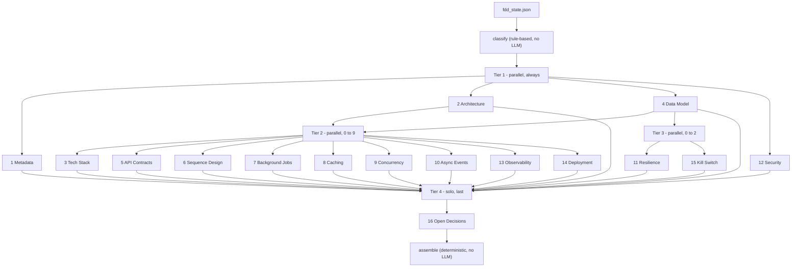
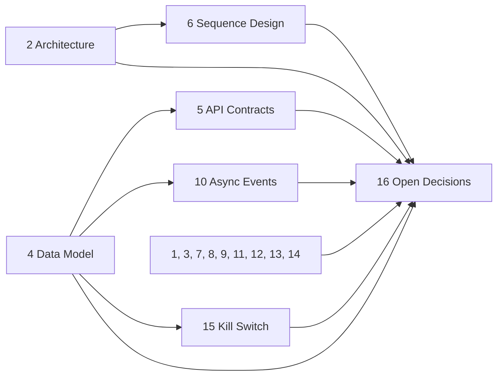

# TDD Multi-Agent Architecture

A 16-agent LangGraph pipeline that turns a finished FDD into a Technical
Design Document. It does not import `fdd_pipeline`. It only reads
`fdd_state.json`.

LangGraph nodes are **execution tiers** (parallel batches), not one node
per agent. The arrows below are the **data dependencies** each agent
actually copies into its `payload` in `run()`. No agent is handed the
full `fdd_sections` dict. Agent 16 is the one agent that reads every
finished TDD section.

Input: `fdd_state.json` (`tier`, `sections`, `raw_user_story`).

Output per run: `output/run_<timestamp>/generated_tdd.md`,
`generated_tdd.pdf`, and `tdd_state.json`.

Graph: `classify → tier1 → tier2 → tier3 → tier4 → assemble`

Agents in the same tier share the same pre-tier state and never see each
other’s output.

---

## 1. Sections, agent files, and tiers

| # | Section | Agent file | Tier | When it runs |
|---|---|---|---|---|
| 1 | Metadata & Traceability | `agents/agent1_metadata.py` | 1 | always |
| 2 | Component Topology & Architecture | `agents/agent2_architecture.py` | 1 | always |
| 4 | Data Model & Schema | `agents/agent4_data_model.py` | 1 | always |
| 12 | Security Architecture | `agents/agent12_security.py` | 1 | always |
| 3 | Tech Stack | `agents/agent3_tech_stack.py` | 2 | FDD-12 `triggered` is true |
| 5 | API & Integration Contracts | `agents/agent5_api_contracts.py` | 2 | `fdd_tier` is medium or large |
| 6 | Sequence / Interaction Design | `agents/agent6_sequence_design.py` | 2 | `fdd_tier` is medium or large |
| 7 | Background Jobs & Schedulers | `agents/agent7_background_jobs.py` | 2 | medium or large, and FDD-7 has `internal_dependencies` |
| 8 | Caching Strategy | `agents/agent8_caching.py` | 2 | FDD-12 `triggered` is true |
| 9 | Concurrency & Race Condition Handling | `agents/agent9_concurrency.py` | 2 | FDD-9 exists and `triggered` is not false |
| 10 | Async / Event Contracts | `agents/agent10_async_events.py` | 2 | FDD-7 has `external_dependencies` |
| 13 | Observability & Telemetry | `agents/agent13_observability.py` | 2 | `fdd_tier` is medium or large |
| 14 | Deployment & Rollout Plan | `agents/agent14_deployment.py` | 2 | `fdd_tier` is large |
| 11 | Resilience & Error Recovery | `agents/agent11_resilience.py` | 3 | FDD-9 exists and `triggered` is not false |
| 15 | Kill-Switch Implementation | `agents/agent15_kill_switch.py` | 3 | large, and FDD-13 exists and `triggered` is not false |
| 16 | Open Technical Decisions | `agents/agent16_open_decisions.py` | 4 | always, last |

Section numbers follow the document, not the tier order. Agents 3, 5, 6,
7, 8, 9, 10, 13, and 14 run together in Tier 2. Agents 11 and 15 run in
Tier 3, after Tier 2. Agent 16 is alone in Tier 4.

`classify` and `assemble` are not LLM agents. A section the classifier
skips is written as `{ "applicable": false }` by `graph.py`. An agent
that runs and decides the section does not apply returns the same shape
itself.

FDD-9 and FDD-13 only contain `triggered: false` when `fdd_pipeline`
skipped those agents. If they ran, the key is absent, and
`triggered is not False` is true, so TDD agents 9, 11, and 15 are included.

---

## 2. Execution tiers

| Tier | Agents | Runs | Depends on |
|---|---|---|---|
| classify | — | first | `fdd_tier`; FDD-7, FDD-9, FDD-12, FDD-13 signals only |
| 1 | 1, 2, 4, 12 | parallel, always | FDD slices only; agents do not see each other |
| 2 | up to 9 of 3, 5, 6, 7, 8, 9, 10, 13, 14 | parallel | FDD slices; 5 and 10 also read Agent 4; 6 also reads Agent 2 |
| 3 | up to 2 of 11, 15 | parallel | FDD slices; 15 also reads Agent 4 |
| 4 | 16 | solo, always last | every `tdd_sections` entry + `tdd_decisions_pool` |
| assemble | — | last | finished sections, no LLM |

A small-tier FDD with no NFR, error-handling, or dependency signals runs
5 LLM calls: Agents 1, 2, 4, 12, and 16. Tier 2 and Tier 3 then have
zero agents.

---

## 3. Internal dependency graph

Which of the 16 agents need another of the 16’s output. An empty cell
means that agent reads only FDD slices (plus `fdd_tier` / `raw_user_story`
for Agent 1).

| Agent | Needs output from |
|---|---|
| 1 Metadata | none |
| 2 Architecture | none |
| 3 Tech Stack | none |
| 4 Data Model | none |
| 5 API Contracts | **4** (`columns`) |
| 6 Sequence Design | **2** (`components`) |
| 7 Background Jobs | none |
| 8 Caching | none |
| 9 Concurrency | none |
| 10 Async Events | **4** (`columns`) |
| 11 Resilience | none |
| 12 Security | none |
| 13 Observability | none |
| 14 Deployment | none |
| 15 Kill Switch | **4** (`table_name`, `existing_table_name`, `columns`) |
| 16 Open Decisions | **1–15** (every finished section) + `tdd_decisions_pool` |

Same-tier agents do not read each other. Agents 5, 6, and 10 are all in
Tier 2, so they read Tier 1 only. Agent 15 is in Tier 3, so it can read
Agent 4. Agent 16 waits until Tier 3 has merged.

---

## 4. Exact per-agent inputs (data DAG)

Every agent reads a named slice. The lists below are the whole payload
built in that agent’s `run()`.

### Tier 1 — raw FDD only

| Agent | FDD | Other |
|---|---|---|
| 1 Metadata | FDD-1: `document_id` | `fdd_tier`, `raw_user_story` |
| 2 Architecture | FDD-4: `requirements`. FDD-7: `internal_dependencies`, `external_dependencies` | — |
| 4 Data Model | FDD-6: `fields`. FDD-13: `migration_notes` | — |
| 12 Security | FDD-2: `persona_definition`. FDD-3: `pre_conditions`. FDD-10: `compliance_notes` | — |

### Tier 2 — FDD slices + Tier 1 outputs

| Agent | FDD | Internal |
|---|---|---|
| 3 Tech Stack | FDD-12: `triggered`, `performance_target`, `concurrency_note` | — |
| 5 API Contracts | FDD-4: `requirements`. FDD-7: `internal_dependencies`, `external_dependencies`. FDD-9: `error_matrix` | Agent 4: `columns` |
| 6 Sequence Design | FDD-5: `happy_path` | Agent 2: `components` |
| 7 Background Jobs | FDD-5: `happy_path`. FDD-12: `performance_target` | — |
| 8 Caching | FDD-12: `triggered`, `performance_target` | — |
| 9 Concurrency | FDD-5: `exception_paths`. FDD-8: `risks` | — |
| 10 Async Events | FDD-7: `external_dependencies` | Agent 4: `columns` |
| 13 Observability | FDD-9: `error_matrix`. FDD-12: `performance_target` | — |
| 14 Deployment | FDD-13: `rollout_strategy_options`, `migration_needed`, `migration_notes` | — |

### Tier 3

| Agent | FDD | Internal |
|---|---|---|
| 11 Resilience | FDD-9: `error_matrix`. FDD-5: `exception_paths` | — |
| 15 Kill Switch | FDD-13: `kill_switch_note` | Agent 4: `table_name`, `existing_table_name`, `columns` |

### Tier 4 — fan-in

| Agent | Reads |
|---|---|
| 16 Open Decisions | `all_tdd_sections`: every section written by Tiers 1–3, including `{ "applicable": false }` stubs. `decisions_pool`: every agent’s `decisions_made`, tagged with its source section. This is the one place the full TDD state is required. |

---

## 5. What assemble adds

`assemble_final_tdd()` does not call the LLM. It walks sections 1–16 in
numeric order and:

- skips a section id that was never written
- prints a short “not applicable” line when `applicable` is false
- otherwise prints the section title and that agent’s JSON

The title line also records `fdd_tier`.
