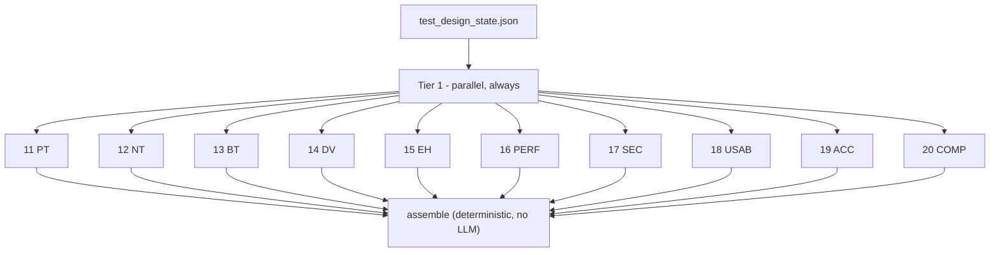
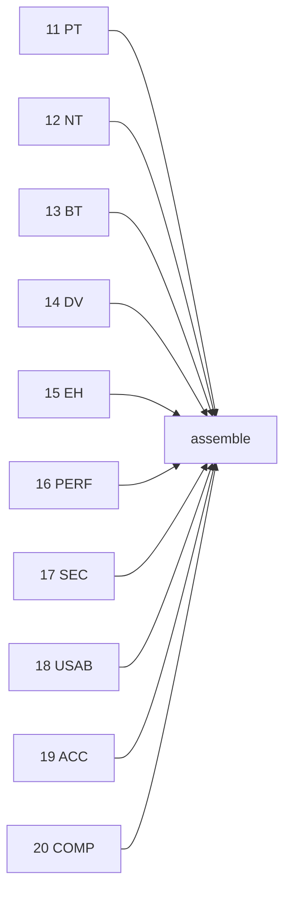
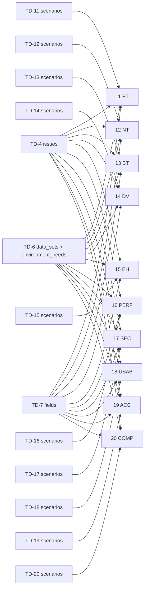

# Test Case Multi-Agent Architecture

A 10-agent LangGraph pipeline that turns a finished Test Design into
step-level test cases. It does not import `fdd_pipeline`, `tdd_pipeline`,
or `test_design_pipeline`. It only reads `test_design_state.json`.

LangGraph nodes are **execution tiers** (parallel batches), not one node
per agent. The arrows below are the **data dependencies** each agent
actually copies into its `payload` in `run()`. No agent is handed the
full `test_design_sections` dict. There is no fan-in LLM agent: none of
the 10 reads another of the 10.

Input: `../test_design_pipeline/output/test_design_state.json`
(`test_sections` is the only key copied into graph state. `fdd_tier`,
`source_fdd_path`, and `source_tdd_path` are not passed to any agent).

Output per run: `output/run_<timestamp>/generated_test_cases.md`,
`generated_test_cases.pdf`, and `test_case_state.json`. A stable copy of
the JSON and PDF is also written to `output/`.

Graph: `tier1 → assemble`

Agents in the same tier share the same pre-tier state and never see each
other’s output.

There is no `classify` node. `test_design_pipeline` already decided which
techniques apply and which scenarios exist. This pipeline only expands
what is already in sections 11–20. An empty `scenarios` array still runs
the agent function, but that function returns without an LLM call.

---

## 1. Sections, agent files, and tiers

| # | Section | Agent file | Tier | When it runs |
|---|---|---|---|---|
| 11 | Positive Testing (PT) | `agents/agent11_positive_testing.py` | 1 | always; LLM only if TD-11 `scenarios` is non-empty |
| 12 | Negative Testing (NT) | `agents/agent12_negative_testing.py` | 1 | always; LLM only if TD-12 `scenarios` is non-empty |
| 13 | Boundary Testing (BT) | `agents/agent13_boundary_testing.py` | 1 | always; LLM only if TD-13 `scenarios` is non-empty |
| 14 | Data Validation (DV) | `agents/agent14_data_validation.py` | 1 | always; LLM only if TD-14 `scenarios` is non-empty |
| 15 | Error Handling (EH) | `agents/agent15_error_handling.py` | 1 | always; LLM only if TD-15 `scenarios` is non-empty |
| 16 | Performance Testing (PERF) | `agents/agent16_performance_testing.py` | 1 | always; LLM only if TD-16 `scenarios` is non-empty |
| 17 | Security Testing (SEC) | `agents/agent17_security_testing.py` | 1 | always; LLM only if TD-17 `scenarios` is non-empty |
| 18 | Usability Testing (USAB) | `agents/agent18_usability_testing.py` | 1 | always; LLM only if TD-18 `scenarios` is non-empty |
| 19 | Accessibility Testing (ACC) | `agents/agent19_accessibility_testing.py` | 1 | always; LLM only if TD-19 `scenarios` is non-empty |
| 20 | Compatibility Testing (COMP) | `agents/agent20_compatibility_testing.py` | 1 | always; LLM only if TD-20 `scenarios` is non-empty |

Section numbers match `test_design_pipeline` sections 11–20. This
pipeline does not renumber them. All ten agents run together in Tier 1.
`assemble` is not an LLM agent.

`test_case_id` is `TC-<prefix>-NN`, using the same two digits as the
source `scenario_id`: `PT-01` → `TC-PT-01`, `NT-01` → `TC-NT-01`,
`BT-01` → `TC-BT-01`, `DV-01` → `TC-DV-01`, `EH-01` → `TC-EH-01`,
`PERF-01` → `TC-PERF-01`, `SEC-01` → `TC-SEC-01`, `USAB-01` →
`TC-USAB-01`, `ACC-01` → `TC-ACC-01`, `COMP-01` → `TC-COMP-01`.

Every test case, ready or blocked, has `title` (a short test title
taken from the scenario title, same scope) and `objective` (one sentence
stating what the test verifies — the intent, not the step-level
expected result).

Each test case is either:

- `status: "ready"` — `title`, `objective`, `preconditions`, `steps`
  (`step_no`, `action`, `test_data`, `expected_result`),
  `overall_expected_result`, `priority` (copied, not re-derived),
  `automatable`
- `status: "blocked"` — `title`, `objective`, `blocked_by_issue`, and
  `reason`. `preconditions`, `steps`, `overall_expected_result`, and
  `automatable` are null

A scenario whose `blocked_by_issue` is set is not skipped automatically.
The agent reads that issue’s `test_impact` from TD-4. A genuine open
behavioral question (two plausible correct answers) stays `blocked`.
One stated assumption that does not contradict the issue produces a
`ready` case, keeps `blocked_by_issue` for traceability, and records the
assumption in that case’s `reason` and in the section’s
`assumptions_made`.

`blocked_by_issue` is a string or null. Several ids are one string
joined with `", "` (`"I-08, I-16"`), never a JSON array. Every agent
prompt ends with the same input and output schema (`agents/common.py`
`IO_SCHEMA`). `merge_section` still joins a list into that string if a
model returns one, so assemble can count cases by issue id.

### `expand_test_cases`

Each of the 10 agents calls `expand_test_cases(system_prompt, payload)`
instead of `call_agent` directly. The first reply often sets
`status: "blocked"` because a number, a maximum, or a schema was never
written down. That is not two opposing pass/fail answers, so the
function sends those cases back once.

1. First call: `call_agent(system_prompt, payload)`, then normalize.
   A list in `blocked_by_issue` is joined into one string.
2. Flag blocked cases that must become ready. A case stays blocked only
   when `reason` names both sides of a fork: rejected or applied,
   rolled back or kept, or required or null. Every other blocked
   reason is flagged, including a reason that says the test can
   proceed. The check is on the reason text, not on the issue id.
3. If nothing is flagged, return the first reply. That agent made one
   model call.
4. If something is flagged, call the model again with the same prompt
   plus a rewrite instruction. The payload gains `previous_test_cases`
   (the full first list) and `rewrite_these_test_cases` (id, scenario
   id, `blocked_by_issue`, and the reason). Those ids must come back
   `ready`, with preconditions, steps, and `overall_expected_result`,
   `blocked_by_issue` still copied, and the assumption in `reason` and
   in `assumptions_made`.
5. Overlay: keep the first reply, and replace only flagged ids that
   the second reply actually returned. Append new assumptions. A
   flagged case that comes back still blocked is left as returned and
   its id is printed. There is no third call.

The second call runs inside that agent's worker, after its first call
returns. It is not another tier, and other agents do not see it. An
empty `scenarios` array returns before `expand_test_cases` is called.

An empty upstream `scenarios` array writes
`{ "test_cases": [], "assumptions_made": ["...nothing to expand."] }`
and does not call the LLM.

---

## 2. Execution tiers

| Tier | Agents | Runs | Depends on |
|---|---|---|---|
| 1 | 11, 12, 13, 14, 15, 16, 17, 18, 19, 20 | parallel, always | named slices of `test_sections` only; agents do not see each other |
| assemble | — | last | every `test_case_sections` entry, no LLM |

Call count is 0–20. A technique whose upstream `scenarios` array is
empty costs no LLM call. A technique with scenarios costs one call,
plus a second call from `expand_test_cases` when that reply blocked a
case for a missing fact rather than a pass/fail fork. A full design
with scenarios in all ten sections costs 10 calls in one parallel
batch, or up to 20 if every agent rewrites.

---

## 3. Internal dependency graph

Which of the 10 agents need another of the 10’s output. Every cell is
empty. `assemble` is the only consumer of finished test-case sections,
and it does not call an LLM.

| Agent | Needs output from |
|---|---|
| 11 Positive Testing | none |
| 12 Negative Testing | none |
| 13 Boundary Testing | none |
| 14 Data Validation | none |
| 15 Error Handling | none |
| 16 Performance Testing | none |
| 17 Security Testing | none |
| 18 Usability Testing | none |
| 19 Accessibility Testing | none |
| 20 Compatibility Testing | none |
| assemble | **11–20** (every finished `test_case_sections` entry) |

Same-tier agents do not read each other. There is no Tier 2 reviewer
the way `test_design_pipeline` has a traceability matrix and next-steps
agent. Nothing in this pipeline has to wait for another technique to
finish except `assemble`.

---

## 4. Exact per-agent inputs (data DAG)

Every agent reads a named slice. The lists below are the whole payload
built in that agent’s `run()`. TD-N means `test_sections["N"]` from
`test_design_state.json`.

Shared slices, copied into every agent that actually calls the LLM:

- TD-4: `issues`
- TD-6: `data_sets`, `environment_needs`
- TD-7: `fields`

Not copied into any payload: TD-1, TD-2, TD-3, TD-5, TD-8, TD-9, TD-10;
the source section’s `assumptions_made`, `decisions_made`, or
`applicable`; `fdd_tier`; `source_fdd_path`; `source_tdd_path`; any
other technique’s `scenarios`.

### Tier 1 — test-design slices only

| Agent | Own scenarios | Shared slices | Other |
|---|---|---|---|
| 11 Positive Testing | TD-11: `scenarios` | TD-4: `issues`. TD-6: `data_sets`, `environment_needs`. TD-7: `fields` | — |
| 12 Negative Testing | TD-12: `scenarios` | TD-4: `issues`. TD-6: `data_sets`, `environment_needs`. TD-7: `fields` | — |
| 13 Boundary Testing | TD-13: `scenarios` | TD-4: `issues`. TD-6: `data_sets`, `environment_needs`. TD-7: `fields` | — |
| 14 Data Validation | TD-14: `scenarios` | TD-4: `issues`. TD-6: `data_sets`, `environment_needs`. TD-7: `fields` | — |
| 15 Error Handling | TD-15: `scenarios` | TD-4: `issues`. TD-6: `data_sets`, `environment_needs`. TD-7: `fields` | — |
| 16 Performance Testing | TD-16: `scenarios` | TD-4: `issues`. TD-6: `data_sets`, `environment_needs`. TD-7: `fields` | — |
| 17 Security Testing | TD-17: `scenarios` | TD-4: `issues`. TD-6: `data_sets`, `environment_needs`. TD-7: `fields` | — |
| 18 Usability Testing | TD-18: `scenarios` | TD-4: `issues`. TD-6: `data_sets`, `environment_needs`. TD-7: `fields` | — |
| 19 Accessibility Testing | TD-19: `scenarios` | TD-4: `issues`. TD-6: `data_sets`, `environment_needs`. TD-7: `fields` | — |
| 20 Compatibility Testing | TD-20: `scenarios` | TD-4: `issues`. TD-6: `data_sets`, `environment_needs`. TD-7: `fields` | — |

`scenarios` is the array of scenario objects already written by
`test_design_pipeline` (`scenario_id`, `title`, `src_refs`,
`design_technique`, `level`, `priority`, `blocked_by_issue`,
`preconditions`, `expected_result`). The agent does not re-read FDD or
TDD to recover those fields.

If `scenarios` is empty, `run()` returns before `payload` is built.
The shared slices are not sent.

What each shared slice is used for:

- `issues`: look up `blocked_by_issue` and read `test_impact` to choose
  `blocked` vs. expand-with-assumption
- `fields`: literal `valid_examples` / `invalid_examples` and `rule`
  text for `test_data`
- `data_sets` and `environment_needs`: concrete env, stubs, tokens,
  and numeric parameters (timeouts, retries, TTLs) already extracted
  by test design

---

## 5. What assemble adds

`assemble_final_test_cases()` does not call the LLM. It walks sections
11–20 in numeric order and:

- prints a coverage header computed by `compute_coverage_summary()`:
  total, execution-ready, blocked, how many ready cases are
  `automatable`, ready counts by P1/P2/P3, per-technique
  total/ready/blocked, and blocked counts grouped by `blocked_by_issue`
- prints “This technique was never run.” when that section id was never
  written
- prints “No test cases generated for this category.” when
  `test_cases` is empty, and includes that agent’s `assumptions_made`
  JSON when present
- otherwise prints the section title and that agent’s JSON

The same coverage object is written into `test_case_state.json` as
`coverage_summary`. The handoff also stores `source_test_design_path`
and `test_case_sections`. `assumptions_pool` (each assumption tagged
with its source agent) stays in graph state only; it is not a separate
key in the handoff file.
