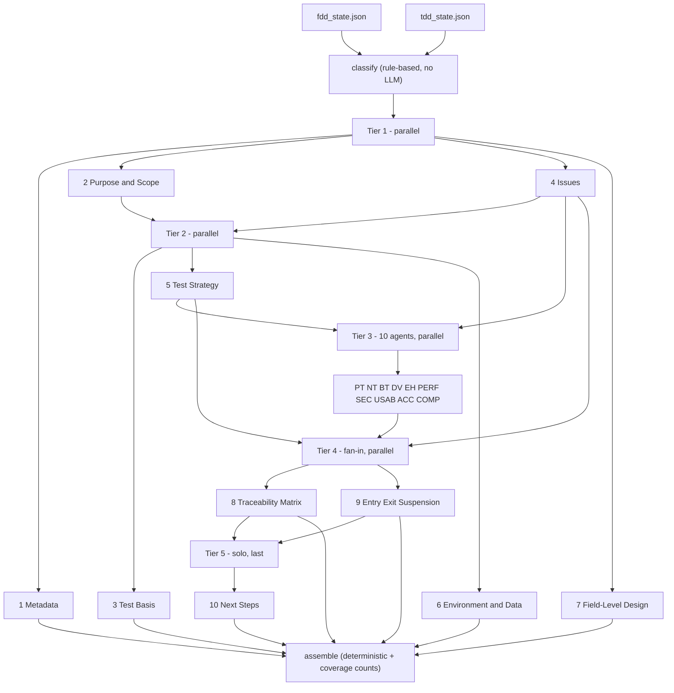
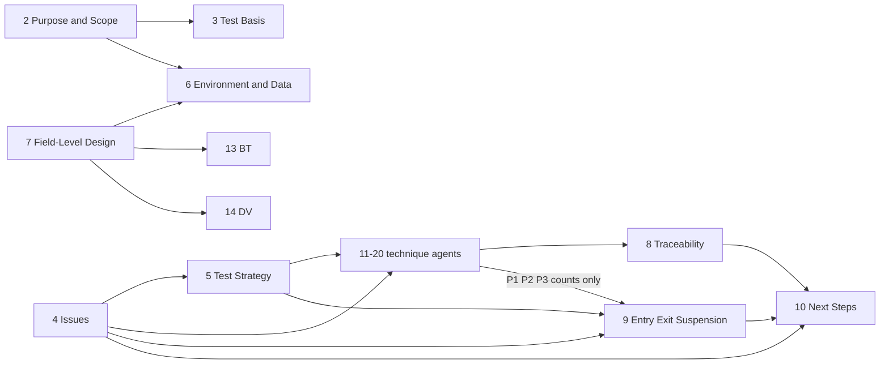

# Test Design Multi-Agent Architecture

A 20-agent LangGraph pipeline that turns a finished FDD and a finished TDD
into a Test Case Design Document. It does not import either pipeline. It
only reads their JSON handoff files.

LangGraph nodes are **execution tiers** (parallel batches), not one node
per agent. The arrows below are the **data dependencies** each agent
actually reads. No agent is handed the full `fdd_sections` /
`tdd_sections` dict except where a row below says so.

Inputs:

- `../fdd_pipeline/output/fdd_state.json` (`tier`, `sections`)
- `../tdd_pipeline/output/tdd_state.json` (`fdd_tier`, `tdd_included_sections`, `tdd_sections`)

Output per run: `output/run_<timestamp>/generated_test_design.md`,
`generated_test_design.pdf`, and `test_design_state.json`.

Graph: `classify → tier1 → tier2 → tier3 → tier4 → tier5 → assemble`

Agents in the same tier share the same pre-tier state and never see each
other’s output.

---

## 1. Sections, agent files, and tiers

| # | Section | Agent file | Tier |
|---|---|---|---|
| 1 | Metadata & document control | `agents/agent1_metadata.py` | 1 |
| 2 | Purpose & scope | `agents/agent2_purpose_scope.py` | 1 |
| 4 | Issues in source documents | `agents/agent4_issues.py` | 1 |
| 7 | Field-level test design | `agents/agent7_field_level_design.py` | 1 |
| 3 | Test basis | `agents/agent3_test_basis.py` | 2 |
| 5 | Test strategy | `agents/agent5_test_strategy.py` | 2 |
| 6 | Test environment & data | `agents/agent6_test_environment_data.py` | 2 |
| 11 | Positive testing (PT) | `agents/agent11_positive_testing.py` | 3 |
| 12 | Negative testing (NT) | `agents/agent12_negative_testing.py` | 3 |
| 13 | Boundary testing (BT) | `agents/agent13_boundary_testing.py` | 3 |
| 14 | Data validation (DV) | `agents/agent14_data_validation.py` | 3 |
| 15 | Error handling (EH) | `agents/agent15_error_handling.py` | 3 |
| 16 | Performance (PERF) | `agents/agent16_performance_testing.py` | 3 |
| 17 | Security (SEC) | `agents/agent17_security_testing.py` | 3 |
| 18 | Usability (USAB) | `agents/agent18_usability_testing.py` | 3 |
| 19 | Accessibility (ACC) | `agents/agent19_accessibility_testing.py` | 3 |
| 20 | Compatibility (COMP) | `agents/agent20_compatibility_testing.py` | 3 |
| 8 | Traceability matrix | `agents/agent8_traceability_matrix.py` | 4 |
| 9 | Entry / exit / suspension criteria | `agents/agent9_entry_exit_criteria.py` | 4 |
| 10 | Next steps | `agents/agent10_next_steps.py` | 5 |

Section numbers follow the document, not the tier order. Agents 3, 5, and
6 run in Tier 2. Agents 8, 9, and 10 run after the ten technique agents.
Agent 10 is alone in Tier 5 so it can read Agents 8 and 9 after they finish.

`classify` and `assemble` are not LLM agents. Every technique agent always
runs. A technique that does not apply returns `{"applicable": false, ...}`
with a reason. It is not dropped.

---

## 2. Execution tiers

| Tier | Agents | Runs | Depends on |
|---|---|---|---|
| classify | — | first | `fdd_tier`; `has_ui_signal` from FDD persona / UI copy |
| 1 | 1, 2, 4, 7 | parallel | raw FDD/TDD slices only; agents do not see each other |
| 2 | 3, 5, 6 | parallel | raw slices + Tier 1 outputs named below |
| 3 | 11–20 | parallel | slices named below + Agents 4 and 5; BT and DV also read Agent 7 |
| 4 | 8, 9 | parallel | Tier 3 scenarios (8 in full, 9 as P1/P2/P3 counts) + Agents 4 and 5 |
| 5 | 10 | solo, last | Agents 8, 9, and 4 |
| assemble | — | last | finished sections; coverage counts, no LLM |

`classify` only derives `test_depth` (an echo of `fdd_tier`) and
`has_ui_signal` (used by USAB and ACC). It does not gate any technique off.

---

## 3. Internal dependency graph

Which of the 20 agents need another of the 20’s output. An empty cell
means that agent reads only FDD/TDD source slices (and, for USAB/ACC, the
classifier flag).

| Agent | Needs output from |
|---|---|
| 1 Metadata | none |
| 2 Purpose & Scope | none |
| 3 Test Basis | 2 |
| 4 Issues | none |
| 5 Test Strategy | 4 |
| 6 Environment & Data | 2, 7 |
| 7 Field-Level Design | none |
| 8 Traceability Matrix | 11–20 (all ten, in full) |
| 9 Entry/Exit/Suspension | 4, 5, plus aggregate P1/P2/P3 counts from 11–20 |
| 10 Next Steps | 8, 9, and 4 |
| 11 PT | 4, 5 |
| 12 NT | 4, 5 |
| 13 BT | 4, 5, **7** |
| 14 DV | 4, 5, **7** |
| 15 EH | 4, 5 |
| 16 PERF | 4, 5 |
| 17 SEC | 4, 5 |
| 18 USAB | 4, 5 |
| 19 ACC | 4, 5 |
| 20 COMP | 4, 5 |

Same-tier agents do not read each other. Agent 1’s section is document
control: no later agent reads it.

Two overlaps are intentional:

- **NT and DV** can both touch invalid field values. NT uses FDD-9
  action-level errors. DV uses Agent 7’s invalid partitions and
  field-format errors.
- **NT and SEC** can both cover a permission-denied case. NT tests the
  generic error contract. SEC tests role, token, and scope.

---

## 4. Exact per-agent inputs (data DAG)

Every agent reads a named slice. The lists below are the whole payload.
“Full state” is not an input.

### Tier 1 — raw FDD/TDD only

| Agent | FDD | TDD |
|---|---|---|
| 1 Metadata | FDD-1: `document_id`, `version`, `client_name`, `module_name`, `title`, `approvers` | TDD-1: `technical_artifact_id`, `version`, `source_fdd_id`, `source_fdd_tier`, `status` |
| 2 Purpose & Scope | FDD-2: `in_scope`, `out_of_scope`, `persona_definition`, `business_objective`. FDD-4: `requirements` (`req_id` + `feature` only) | TDD-5: `endpoints` (`route` + `description` only). TDD-9, TDD-11, TDD-12, TDD-15: `applicable` flags only |
| 4 Issues | FDD-4. FDD-5: `exception_paths`. FDD-6: `fields`. FDD-8: `risks`, `implied_gaps`. FDD-9: `error_matrix`. FDD-12: `performance_target`, `concurrency_note`. FDD-13: `migration_notes`, `kill_switch_note` | TDD-4: `columns`. TDD-5: `endpoints` including `error_responses`. TDD-9: `lock_strategy`, `reconciliation_notes`. TDD-11: `mechanisms`. TDD-12: `authn_authz`, `token_scopes`. TDD-15. TDD-16: `decisions` + `conflicts` |
| 7 Field-Level Design | FDD-6: `fields` | TDD-4: `columns`. TDD-5: `request_fields` / response fields only |

Agent 4 does not read FDD-1, 2, 3, 7, 10, 11 or TDD-1, 2, 3, 6, 7, 8, 10,
13, 14.

### Tier 2 — raw slices + Tier 1 outputs

| Agent | Reads |
|---|---|
| 3 Test Basis | `fdd_tier`. Presence / `triggered` flags of FDD-9, FDD-10, FDD-12, FDD-13. `tdd_included_sections`. Agent 2 output (`in_scope`). Structural cross-reference, not a re-summary of section bodies. |
| 5 Test Strategy | `fdd_tier`. `tdd_included_sections` (flags only). Agent 4 output (`issues`, for P1-escalation rules). |
| 6 Environment & Data | FDD-7: `internal_dependencies`, `external_dependencies`. Agent 7 output (field partitions; does not re-read FDD-6). TDD-4: `table_name`, `columns`. TDD-9: `applicable`, `lock_strategy`. TDD-11: `mechanisms`. TDD-12: `token_scopes`, `authn_authz`. TDD-15: `config_key`. TDD-10: `topic_name` if applicable. Agent 2 output (scope). |

### Tier 3 — ten technique agents

| Agent | FDD | TDD | Internal |
|---|---|---|---|
| 11 PT | FDD-4. FDD-11: given/when/then. FDD-5: `happy_path` only | TDD-5: `success_response` only. TDD-6: sequence | Agent 4, Agent 5 |
| 12 NT | FDD-5: `exception_paths` only. FDD-9 | TDD-5: `error_responses` only | Agent 4, Agent 5 |
| 13 BT | — (uses Agent 7, not raw FDD-6) | TDD-11: numeric retry / timeout / backoff params only | Agent 7, Agent 4, Agent 5 |
| 14 DV | — (uses Agent 7, not raw FDD-6) | TDD-4: CHECK / enum / NOT NULL constraints | Agent 7, Agent 4, Agent 5 |
| 15 EH | FDD-5. FDD-9 | TDD-11: full `mechanisms`. TDD-9. TDD-15: `fallback_behavior` | Agent 4, Agent 5 |
| 16 PERF | FDD-12 | TDD-3. TDD-13: metrics. TDD-9: `applicable` only | Agent 4, Agent 5 |
| 17 SEC | FDD-2: persona. FDD-9: permission-denied entries only | TDD-12: full | Agent 4, Agent 5 |
| 18 USAB | FDD-2. FDD-9: `user_facing_behavior` text | TDD-5: error message fields | `has_ui_signal`, Agent 4, Agent 5 |
| 19 ACC | FDD-2. FDD-10: `accessibility_notes` | — (only if a UI endpoint exists) | `has_ui_signal`, Agent 4, Agent 5 |
| 20 COMP | FDD-10 | TDD-12: TLS versions. TDD-14: canary cohorts. TDD-4: timestamp types | Agent 4, Agent 5 |

BT and DV consume **Agent 7’s partition table**. They do not re-derive
boundaries from raw FDD-6 / TDD-4.

NT and EH both read FDD-5 and FDD-9, then split:

- NT: what the caller sees for bad input or a bad action.
- EH: how the system recovers from a dependency or infra failure
  (retries, circuit breaker, rollback).

Each Tier 3 scenario object:

| Field | Value |
|---|---|
| `scenario_id` | id |
| `title` | short name |
| `src_refs` | FDD/TDD section or FR/AC ids |
| `design_technique` | Equivalence Partitioning, Boundary Value Analysis, Decision Table, State Transition, Fault Injection, Concurrency/Race, Error Guessing, Inspection |
| `level` | Unit, Integration, API, E2E, Performance, Security, Deployment |
| `priority` | P1 / P2 / P3, using section 5’s rubric |
| `blocked_by_issue` | nullable link to an I-xx from section 4 |
| `preconditions` | setup |
| `expected_result` | expected outcome |
| `testing_type` | PT, NT, BT, DV, EH, PERF, SEC, USAB, ACC, or COMP |

### Tier 4 — fan-in

| Agent | Reads |
|---|---|
| 8 Traceability Matrix | FDD-4 (FR ids). FDD-11 (AC names). TDD-5 (error codes). **All 10** Tier 3 scenario lists in full. This is the one place the full Tier 3 output is required. |
| 9 Entry/Exit/Suspension | Agent 5. Agent 4. Aggregate P1/P2/P3 **counts** from Tier 3 (not scenario bodies). TDD-14: steps / success criteria. TDD-15. `fdd_tier`. |

### Tier 5 — solo, last

| Agent | Reads |
|---|---|
| 10 Next Steps | Agent 8 (traceability gaps: FRs/ACs with zero scenario coverage). Agent 9 (exit criteria, open suspension risks). Agent 4 (unresolved issues). `fdd_tier`. |

---

## 5. What assemble adds

`assemble_final_test_design()` does not call the LLM. It renders sections
in reading order:

1. Metadata
2. Purpose & scope
3. Test basis
4. Issues
5. Test strategy
6. Test environment & data
7. Test scenarios (agents 11–20 grouped under one heading)
8. Field-level design
9. Traceability matrix
10. Entry / exit / suspension
11. Next steps

It also computes total scenario count, the P1/P2/P3 breakdown, and a
per-technique subtotal.
